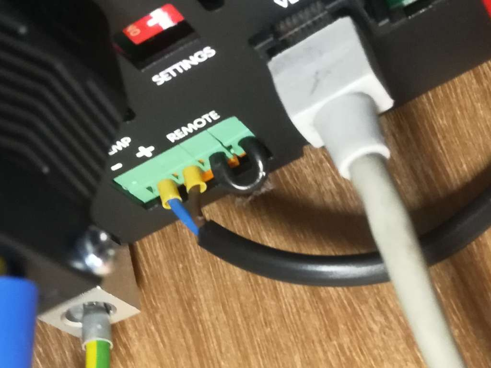

# Disable/enable AES programmatically on Victron inverters with Node-RED

This Node-RED flow allows you to disable AES (power saving mode) on Victron inverters. This is useful when plugging in loads too small to turn the inverter on, or loads that draw little current to begin with.

## You will need

* A Raspberry Pi (or other GX device) running Victron's Venus OS
* A Victron inverter (Multiplus/Quattro/Easysolar etc)
* A VE.Bus to USB cable to configure the inverter
* A 5V relay module (unless you're using a GX device)

## Installation

### Install Venus OS large

If you're already running Venus OS, you'll need to switch to the large version which includes Node-RED. You can do this via the menu system, see the manual [here](https://www.victronenergy.com/live/venus-os:large).

### Connect 5V relay

Connect the + pin to the same 5V supply as your Pi, the - pin to the supply's ground, and the S pin to GPIO 21 (pin 40) on the Pi. For multiple relays, install [SetupHelper](https://github.com/kwindrem/SetupHelper) and [RpiGpioSetup](https://github.com/kwindrem/RpiGpioSetup). Be sure to use an active-high module that can trigger on a 3.3v signal.

### Configure inverter

Use [VEConfigure](https://www.victronenergy.com/support-and-downloads/software) to configure the inverter. Disable virtual switch and add 3 assistants:

* General flag user: use general flag to disable AES
* Programmable relay: use general flag; set relay on; when temperature sense input is closed for 0 seconds
* Programmable relay: use general flag; set relay off; when temperature sense input is open for 0 seconds

If you have more digital inputs than just the temperature sensor, you can use AUX1 or AUX2 instead.

Connect the relay (COM and NO) to the inverter's digital input. Either way round is fine. If you're using a GX device instead of a Pi, you don't need a separate relay module - just connect the COM and NO pins of one of its relays.

### Import Node-RED flows

Go to Node-RED (https://venus.lan:1881 or https://venus_ip:1881) and import the flow from flows.json in this repo. Edit the Victron nodes as necessary for your system, then deploy.

### Access locally or via VRM

Go to the dashboard at https://venus.lan:1881/ui and try it out! Press the buttons to disable AES for 1 minute or 1 hour.

You can also access the dashboard remotely by going to your installation on [Victron VRM](https://vrm.victronenergy.com), selecting Venus OS Large in the left hand menu and choosing Node-RED dashboard.

For more information, see my [blog post](https://asdfghjkl.me.uk/blog/multiplus-aes-node-red).
